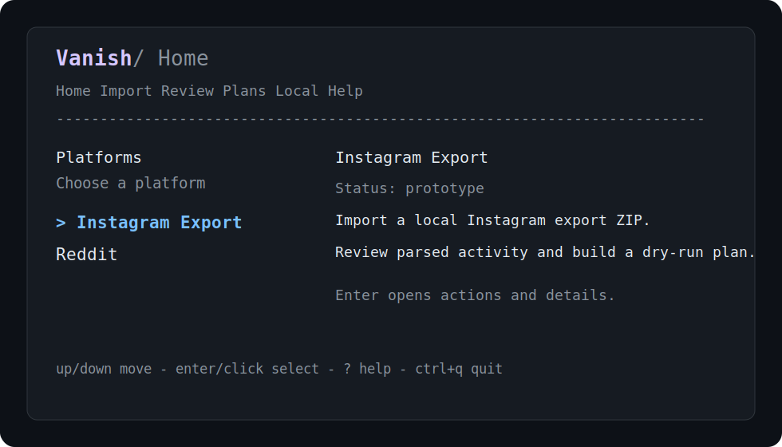
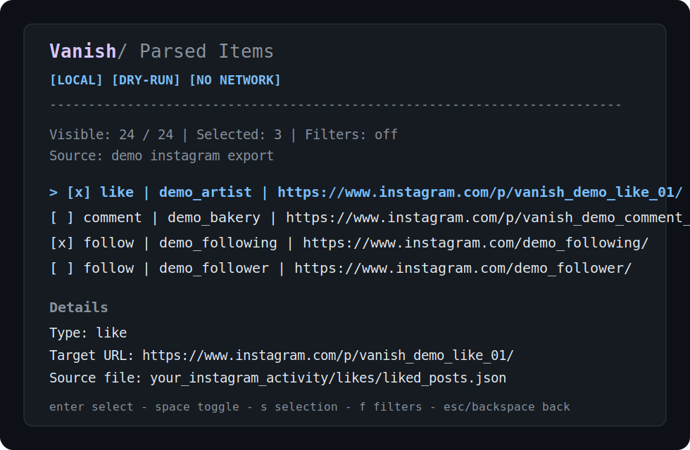
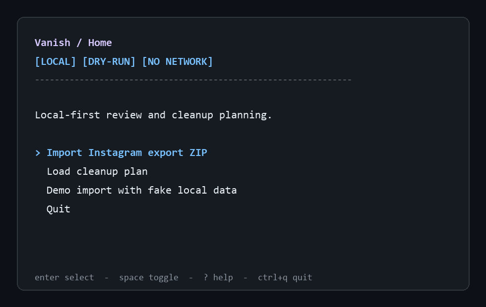

# Vanish

Vanish is an open-source, local-first terminal app for reviewing social media
activity and building safe cleanup plans.

Current status: **v0.1.0-alpha**. The app is useful for local review and dry-run
planning, but it does not delete platform content or apply account changes.

The v0.2 local workspace and v0.4 multi-platform foundation are documented
here, but those versions have not been released. The same alpha limits still
apply: Vanish remains local-only, dry-run-only, and does not log in to
platforms or apply cleanup actions.







## What Vanish Is

- A local terminal UI for reviewing exported social activity.
- A dry-run planner for cleanup actions you may want to take later.
- A small platform registry that labels prototype and planned support honestly.
- A privacy-focused alternative to tools that require account access too early.
- Open source and designed around inspectable local files.

## What Vanish Is Not

- Vanish does not make you invisible on the internet.
- Vanish does not log in to Instagram.
- Vanish does not use browser automation, scraping, private APIs, or cloud jobs.
- Vanish does not delete platform content, unlike, unfollow, or apply account
  changes in this alpha.

## Local-First Safety

- No cloud backend.
- No telemetry by default.
- No credentials collected.
- No passwords, cookies, tokens, sessions, or raw private messages in plan files.
- Local Instagram export ZIPs are read from disk only.
- Cleanup plans are dry-run JSON files you can inspect before doing anything else.

See [docs/safety.md](docs/safety.md) for the longer safety model and
[docs/platforms.md](docs/platforms.md) for platform status.

## Local Data Behavior

Vanish v0.2 keeps a local workspace so recent work is easier to inspect without
re-importing everything. This local data is stored on your machine in the Vanish
app directory and is not synced to a hosted account.

The app directory stores:

- Configuration needed by the local app, including local workspace timestamps
  and the last/default plan paths used by the TUI.
- Recent import history with file path, total count, per-type counts, skipped
  count, warning count, and demo/source metadata.
- Recent cleanup plan history with file path, plan creation time, last used
  time, last operation, and plan summary metadata.
- A local audit log for workspace events such as imports, plan exports, plan
  loads, and wipes.

The app directory does not store raw parsed items, raw exports, raw comments,
credentials, cookies, tokens, sessions, or authorization data. Imported export
ZIPs and exported plans remain normal local files at the paths you choose.

Default app directory locations:

- Windows: `%APPDATA%\vanish`
- macOS: `$HOME/Library/Application Support/vanish`
- Linux: `${XDG_CONFIG_HOME:-$HOME/.config}/vanish`

For development and tests, set `VANISH_APP_DIR` to point Vanish at a disposable
workspace:

```bash
VANISH_APP_DIR=/tmp/vanish-dev go run ./cmd/vanish
```

On PowerShell:

```powershell
$env:VANISH_APP_DIR = "$env:TEMP\vanish-dev"
go run ./cmd/vanish
```

The local data wipe flow clears Vanish-managed configuration, history, and audit
records from the active app directory. It does not delete the original Instagram
export ZIPs or cleanup plan JSON files unless those files are inside the active
app directory.

See [docs/local-data.md](docs/local-data.md) for the detailed local workspace
model.

## Supported Today

- Instagram Export prototype: local ZIP import.
- Demo import with fake local Instagram data.
- Parsed item browsing.
- Filtering by item type, actor, target, and date.
- Review selection.
- Dry-run plan generation.
- Plan export to JSON.
- Plan loading and viewing.

## Not Supported Yet

- Automatic deletion or apply/execution.
- Instagram login.
- Browser automation.
- Reddit import, account connection, or scanning. Reddit is visible as planned
  only in the platform selector.
- Other platform integrations beyond Instagram Export and planned Reddit.
- Cloud sync or hosted accounts.

See [docs/platforms.md](docs/platforms.md) for the full platform matrix.

## Install And Run

Requirements:

- Go 1.26 or newer.
- A terminal that supports interactive TUI apps.

Run from source:

```bash
git clone https://github.com/itsmeares/vanish.git
cd vanish
go run ./cmd/vanish
```

Run tests:

```bash
go test ./...
```

## Try The Demo Import

The demo import creates a temporary fake Instagram export ZIP on your machine.
It includes fake likes, comments, following records, follower records, and
unsupported files so you can test warnings, filters, selection, and plan
generation without using a real export.

```bash
go run ./cmd/vanish
```

Then choose **Instagram Export**, then **Demo import with fake local data**.

## Use A Real Instagram Export ZIP

1. Download your Instagram data export from Instagram.
2. Keep the ZIP on your local machine.
3. Run `go run ./cmd/vanish`.
4. Choose **Instagram Export**.
5. Choose **Choose export ZIP**.
6. Review parsed items, warnings, filters, and selection.

Vanish reads local JSON files from the ZIP. It does not contact Instagram.

## Export And Load Plans

To export a dry-run plan:

1. Import demo data or a local Instagram ZIP.
2. Open parsed items.
3. Toggle items with `Enter` or `Space`.
4. Open **Review selection**.
5. Choose **Generate dry-run plan**.
6. Choose **Export JSON**.

The default output path is `vanish-plan.json`.

To load a plan:

1. Start Vanish.
2. Open the **Plans** tab.
3. Enter the local JSON path.
4. Review the plan summary and action list.

## Keybindings

- `Up` / `Down` or `j` / `k`: move.
- `Enter`: primary action; toggles the highlighted parsed item.
- `Space`: toggles the highlighted parsed item.
- `Esc`: back.
- `Backspace`: back when no text input is focused.
- `?`: help screen.
- `Ctrl+Q` or `Ctrl+C`: quit confirmation.

Plain `q` does not quit.

## Release Prep

See [docs/release-checklist.md](docs/release-checklist.md) for the v0.1.0-alpha
release checklist.

## License

AGPL-3.0.

Vanish is not affiliated with Instagram, Meta, Redact, Reddit, X, YouTube, or
any supported or planned platform.
