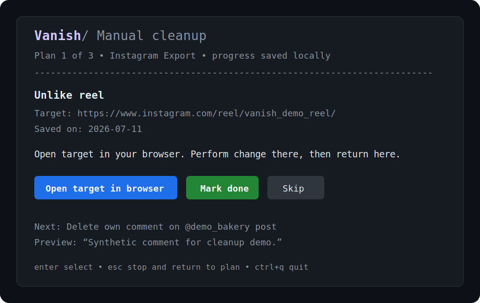

# Vanish

Vanish is an open-source, local-first app for finding, reviewing, and cleaning
up your social media footprint across platforms.

It brings your activity into one place so you can decide what should stay, what
should go, and clean it up on your own terms.

Vanish currently runs as an interactive terminal application.




## Current Alpha

`v0.1.0-alpha` focuses on Instagram export data and assisted manual cleanup.
It can:

- Open Meta's official export page after your explicit selection.
- Import a local Instagram JSON export ZIP, including supported data from a
  partial export.
- Review, filter, and select activity before generating a local cleanup plan.
- Guide manual unfollow, unlike, and own-comment deletion actions in your
  browser. Vanish never performs those Instagram changes itself.
- Stop a cleanup session, close Vanish, reopen it, and resume later.
- Load and review saved cleanup plans.
- Keep local history, audit records, workspace data, and a local-data wipe flow.
- Keep no-op execution progress in a durable local journal and offer explicit,
  safety-classified resume or abandonment after restart.
- Import an official X/Twitter archive ZIP, retain only supported current posts
  and linked media, and browse that read-only dataset after restart.
- Offer a read-only Reddit official API planner prototype.

Vanish does not yet provide automatic or complete multi-platform cleanup. See
[docs/platforms.md](docs/platforms.md) for current support and
[docs/safety.md](docs/safety.md) for boundaries.

## Platform Support

| Platform | Import or scan | Cleanup planning | Assisted cleanup | Automatic cleanup |
| --- | --- | --- | --- | --- |
| Instagram Export | Supported | Supported | Supported | No |
| X / Twitter Archive | Supported local archive | No | No | No |
| Reddit | Official API, access pending | Prototype | No | No |
| Other platforms | Planned | Planned | Planned | Planned |

Instagram Export is the cleanup path. X archive support is a local-only,
read-only post browser; see [docs/x-archive.md](docs/x-archive.md). Reddit is an experimental,
read-only official API planner prototype. A developer access request has been
submitted to Reddit, and the project is awaiting a response, so the integration
may not be usable in public builds yet. Approval has not been granted. Reddit
access does not block this Instagram alpha release.

## How Vanish Works

1. Request or import social activity data.
2. Review and filter activity.
3. Select what should be cleaned up.
4. Generate a cleanup plan.
5. Work through supported cleanup actions.
6. Stop and resume later.

## Download and Install

Prebuilt alpha binaries will be available from the
[GitHub Releases page](https://github.com/itsmeares/vanish/releases). Choose
the archive for your platform, extract it, and run the executable:

| Platform | Archive | Run |
| --- | --- | --- |
| Windows amd64 | `vanish_<tag>_windows_amd64.zip` | Extract archive, then run `vanish.exe`. |
| Linux amd64 | `vanish_<tag>_linux_amd64.tar.gz` | `tar -xzf <archive>` then `./vanish_<tag>_linux_amd64/vanish` |
| Linux arm64 | `vanish_<tag>_linux_arm64.tar.gz` | `tar -xzf <archive>` then `./vanish_<tag>_linux_arm64/vanish` |
| macOS amd64 | `vanish_<tag>_darwin_amd64.tar.gz` | `tar -xzf <archive>` then `./vanish_<tag>_darwin_amd64/vanish` |
| macOS arm64 | `vanish_<tag>_darwin_arm64.tar.gz` | `tar -xzf <archive>` then `./vanish_<tag>_darwin_arm64/vanish` |

For `v0.1.0-alpha`, names are equivalent to
`vanish_v0.1.0-alpha_windows_amd64.zip` and the matching Linux/macOS archives.
Each release also includes `checksums.txt` for SHA-256 integrity checking.

Alpha binaries are unsigned, so your operating system may show a warning. A
checksum confirms that an archive has not changed since release; it is not code
signing or identity verification.

On Windows PowerShell:

```powershell
Expand-Archive -LiteralPath .\vanish_v0.1.0-alpha_windows_amd64.zip -DestinationPath .
Set-Location .\vanish_v0.1.0-alpha_windows_amd64
.\vanish.exe
```

## Build from Source

Vanish requires Go `1.26.4` (the version declared in `go.mod`) and a terminal
that supports interactive TUI apps.

```bash
git clone https://github.com/itsmeares/vanish.git
cd vanish
go run ./cmd/vanish
```

Run checks with:

```bash
gofmt -l .
go test -count=1 ./...
go vet ./...
go build ./cmd/vanish
```

## Instagram Export

In Instagram, use this current Meta export flow:

1. **Instagram Settings**
2. **Accounts Centre**
3. **Your information and permissions**
4. **Export your information**
5. **Create export**
6. Choose the Instagram profile.
7. Choose **Export to device**.
8. **Customise information**.
9. Set **Date range** to **All time**.
10. Set **Format** to **JSON**.
11. Start the export.

Meta may take time to prepare the export; Vanish does not need to remain open.
Partial exports can still be imported when they contain supported data. The ZIP
stays on your machine.

## Privacy and Safety

Vanish has no cloud backend or default telemetry. It does not collect platform
passwords, cookies, browser sessions, or private API access, and it does not
scrape or automate a browser. Instagram cleanup remains user-directed manual
work in the system browser. X archive import performs no network access or
remote post actions.

The Reddit prototype is the narrow exception to local-file-only behavior: it
uses the official API within its documented read-only boundary. Details live in
[docs/safety.md](docs/safety.md).

## Local Data

Vanish stores local workspace metadata, history, audit records, safe manual
cleanup progress, and durable no-op execution journals in its app directory. It
does not copy raw exports. For X archive browsing, it explicitly retains
normalized supported post text and linked media under `x-archives/`; that data
is removed by local-data wipe. Original export ZIPs and plan files outside the
app directory are not deleted.

For Reddit, the operating-system credential store is primary. Only after
explicit confirmation, an unavailable credential store may use a
permission-restricted local-file fallback under the app directory. When the
credential store returns, Vanish migrates the secret and removes that fallback.
Wipe removes fallback files there, but not secrets held by the operating-system
credential store.

See [docs/local-data.md](docs/local-data.md) for locations, retained metadata,
and wipe behavior.

## Known Limitations

- Instagram changes are performed manually in your browser.
- Instagram export formats can change.
- Comment previews are memory-only and disappear after restart.
- X archive support is read-only and covers current posts, replies, quote
  posts, reposts, and current community posts only.
- Reddit remains an experimental read-only prototype awaiting developer access.
- Vanish has no automatic platform mutations or browser automation.

## Development

See [docs/release-checklist.md](docs/release-checklist.md) for release checks
and [docs/platforms.md](docs/platforms.md) for support details. Contributions
should preserve the local-first and explicit-user-action boundaries documented
in [docs/safety.md](docs/safety.md).

## License and affiliation

AGPL-3.0. Vanish is not affiliated with Instagram, Meta, Reddit, Redact, X,
YouTube, or any supported or planned platform.
